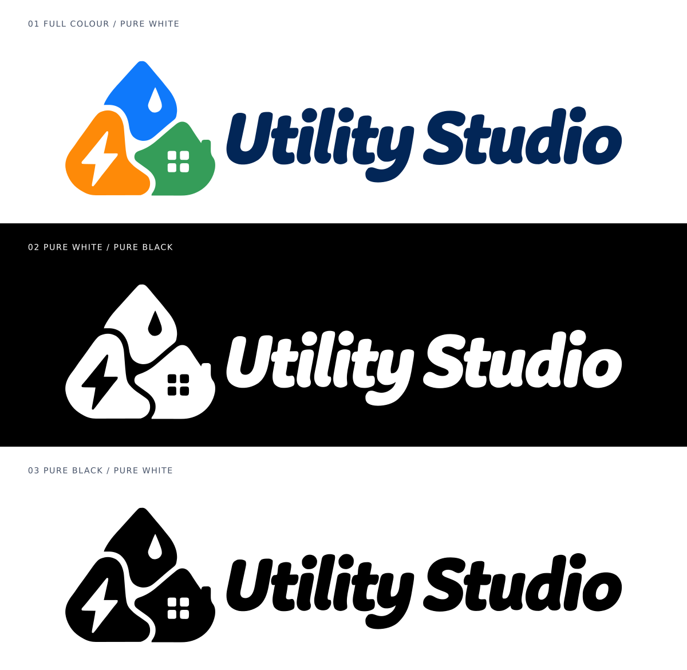

# Utility Studio brand assets

Approved direction: option 5, with the icon to the left and **Utility Studio** on one line to the right. Approved by Greg on 2026-10-02.



## Production assets

All production SVGs use vector paths, including the lettering. They contain no embedded bitmap, live text, external font, or external resource. The water drop, lightning bolt, windows and letter counters are transparent cutouts, so the logo also works on coloured backgrounds.

| Use | File |
| --- | --- |
| Default horizontal logo, transparent background | `utility-studio-horizontal-color.svg` |
| White logo for dark backgrounds, transparent | `utility-studio-horizontal-white.svg` |
| Black logo for light backgrounds, transparent | `utility-studio-horizontal-black.svg` |
| Inline SVG that inherits CSS `color` | `utility-studio-horizontal-mono.svg` |
| Compact icon, transparent background | `utility-studio-icon-color.svg` |
| Compact white / black / CSS-colour icons | `utility-studio-icon-{white,black,mono}.svg` |

`utility-studio-{color-on-white,white-on-black,black-on-white}.svg` are presentation exports with explicit pure white (#FFFFFF) or pure black (#000000) backgrounds. The comparison sheet is supplied as SVG and PNG. Its small descriptive labels use a system font; the logo itself is always outlined.

## Integration

Use the horizontal colour SVG for a light header, and the white SVG for a dark header. Copy the selected files to the consuming app's static/public asset directory or import them through its bundler. This asset handoff does not change the application or build pipeline.

```html

```

Maintain the SVG viewBox and aspect ratio; do not stretch or re-typeset the wordmark. The horizontal asset includes modest clear space. At very narrow sizes use the icon: suggested minimum widths are 200 px for the complete lockup and 32 px for the icon. A simplified favicon may be needed at 16 px.

The `mono` version inherits `currentColor` when inserted inline. CSS colour from a parent page does not propagate into an SVG loaded through an `` element; use the explicit black or white asset in that case.

## Windows executable icon

`launcher/utility-studio.ico` contains the compact colour mark on transparent square canvases at
16, 20, 24, 32, 40, 48, 64, 96, 128 and 256 px. Regenerate it with
`node scripts/build_windows_icon.cjs` with `sharp` available to Node (build-only; not shipped).
The release builder embeds it in both the Go launcher and the Windows engine executable.
The Go resource compiler is pinned to `github.com/akavel/rsrc@v0.10.2`; generated `.syso` files are temporary.

## Palette

| Element | Colour |
| --- | --- |
| Water | `#0F79FB` |
| Electricity | `#FE8A08` |
| Home | `#359D59` |
| Wordmark | `#022657` |

These are flat colours sampled from the approved horizontal concept. The generated concept's slight raster texture has been removed. The vector contours were traced from that approved artwork to preserve its shapes and lettering, rather than substituting a font.

## Checks

All production assets parse as SVG and contain paths without raster images or font dependencies. Colour and monochrome versions share the same path geometry. The three versions were rendered and visually checked, including their negative-space details on both white and black backgrounds.
