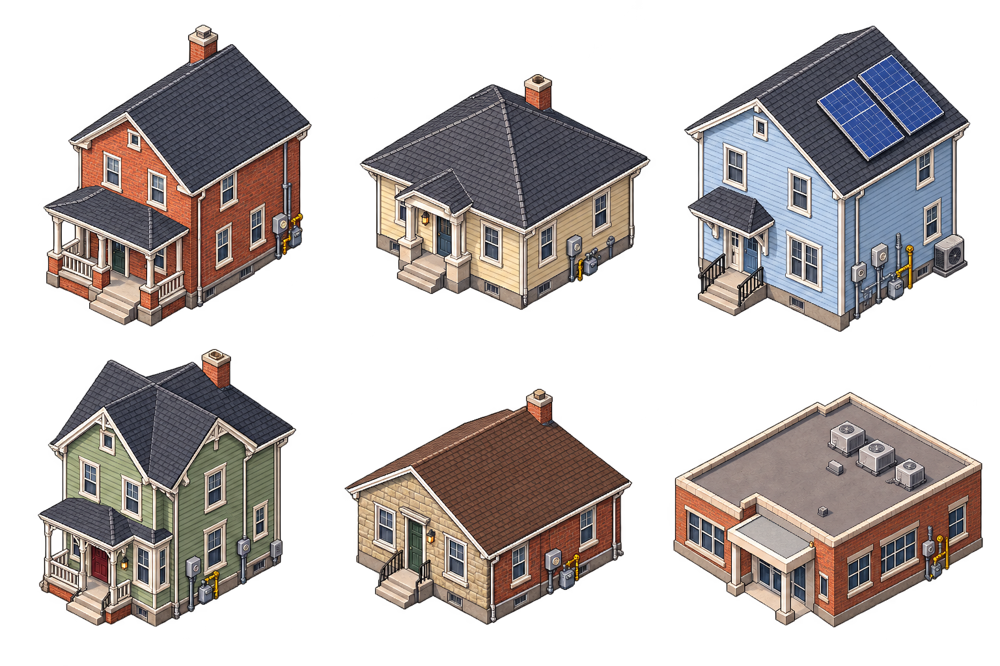
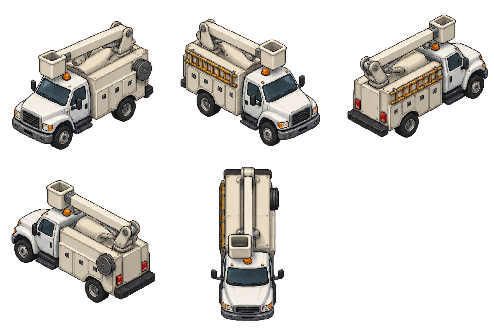

# Isometric town artwork

Start with [the Astra art handoff](../../../docs/ISOMETRIC_ART_HANDOFF.md). This directory brings the Pixel Town artwork into the Utility Sim repository so it can be reviewed and integrated here.

## Included sheets

- `ne.png`, `nw.png`, `se.png`, `sw.png`, `top.png`: original house and school banks for four isometric cameras and top down.
- `diagonal.png`, `diagonal-sides.png`: additional house facings for streets that do not follow a grid.
- `equipment.png`, `equipment-top.png`: original roadside utility equipment.
- `bounds.json`: crop metadata used by the prototype renderer.
- `batch-v2/`: twelve new facility, crew and meter sheets with prompts, proposed engine bindings, provenance and per-family QA.
- `prototype-reference/`: reference renderer and original prototype notes for camera/facing, scale and attachment behavior.

These are review assets. Five intended view positions do not guarantee five consistent projections: duplicated angles, oblique overheads and detail drift are documented in [the QA notes](batch-v2/qa-notes.txt). The selected PNGs are copied byte-for-byte from the original handoff. The engine/production viewer is unchanged by this import.

Open `batch-v2/index.html` locally to filter and enlarge the new sheets. It works without a web server. Engine-driven outage, damage and operating variants remain future work.

## Samples

House bank:

Bucket truck study:

Source: Pixel Town commit `29b7e4e06702f47a228d9fb01547a3cbac11d80c`.
